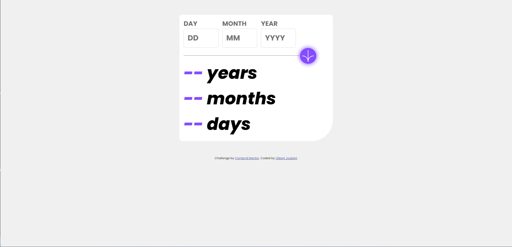
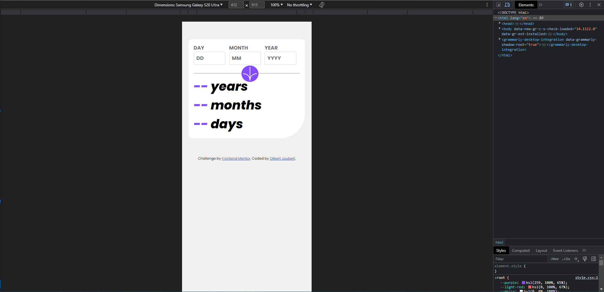

# Frontend Mentor - Age calculator app solution

This is a solution to the [Age calculator app challenge on Frontend Mentor](https://www.frontendmentor.io/challenges/age-calculator-app-dF9DFFpj-Q). Frontend Mentor challenges help you improve your coding skills by building realistic projects.

## Table of contents

- [Overview](#overview)
  - [The challenge](#the-challenge)
  - [Screenshot](#screenshot)
  - [Links](#links)
- [My process](#my-process)
  - [Built with](#built-with)
  - [What I learned](#what-i-learned)
  - [Continued development](#continued-development)
- [Author](#author)

## Overview

### The challenge

Users should be able to:

- View an age in years, months, and days after submitting a valid date through the form
- Receive validation errors if:
  - Any field is empty when the form is submitted
  - The day number is not between 1-31
  - The month number is not between 1-12
  - The year is in the future
  - The date is invalid e.g. 31/04/1991 (there are 30 days in April)
- View the optimal layout for the interface depending on their device's screen size
- See hover and focus states for all interactive elements on the page
- **Bonus**: See the age numbers animate to their final number when the form is submitted

### Screenshot

### Links

- Solution URL: [https://www.frontendmentor.io/solutions/age-calculator-MVzTg5yKqe]
- Live Site URL: [https://age-calculator-mu-blush.vercel.app/]

## My process

### Built with

- Semantic HTML5 markup
- CSS custom properties
- Flexbox
- CSS Grid
- Mobile-first workflow

### What I learned

Calculating the age with months and days had me going a bit to be honest. I learned to keep it simple and not over complicated things

The JS section is really something that I'm proud of. Building it in React would have been easier but less of a challenge

Adding an animation to the Years, Month and Days was something new to me

### Continued development

In future versions I would like to add a loading indicator especially on slow networks, at the moment it is lacking this functionality

## Author

- Frontend Mentor - [@Okkie14](https://www.frontendmentor.io/profile/Okkie14)
